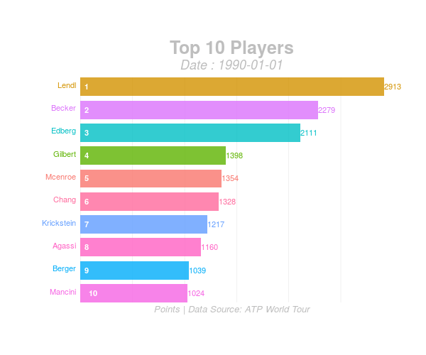

## Data Summary
> - Weekly Rankings of Top 1000 
>       - Data ranges from 1973-2018
>      - 2,746,003 obs. of 4 variables
>      - 1,670,401 obs. of 5 variables
 
> - Player Data
>      - 53,319 obs. of 6 variables
>      - 21,750 obs. of 6 variables
    

> - https://maxfritz.shinyapps.io/rankings/

## Weekly Top 10 Graphic {.build}

## Weekly Top 10 Graphic (cont.)

> - Top 10 players at given week
> - Ordered by rank
> - Height of bars: points
> - Built with ggplot and gganimate

## Weekly Top 10 Graphic (cont.)

> - Focus on relative positioning
> - Smooth shifting bars
> - Auto-scaling x-axis
> - Label positioning, tracking with variable values

## Weekly Top 10 Graphic (cont.)

> - Small formatting errors
> - Difficulty in animating transition states between integer values

## Weekly Top 10 Graphic (cont.) 

> - Rebuild in D3
>    - Animation quality
>    - Proper graphics scaling
>    - Able to manipulate parameters, start/stop

## Ranking History - Step Graph
<iframe width="900" height="800" frameborder="0" scrolling="no" src = "https://maxfritz.rstudio.cloud/a57643922f924b45bf424d906132dd16/file_show?path=%2Fcloud%2Fproject%2Fatp_no1_hist.html"></iframe>

https://maxfritz.rstudio.cloud/a57643922f924b45bf424d906132dd16/file_show?path=%2Fcloud%2Fproject%2Fatp_no1_hist.html

## Ranking History - Step Graph (cont.)

> - Built with Plotly
   
> - Stepped line graph by rank, over time
   
> - Ranking history for every World No.1

## Ranking History - Step Graph (cont.)

> - Ability to select and compare individual players
   
> - Refine by time frame
   
> - Auto-scaling axis
   
> - Free of clutter

## Ranking History - Step Graph (cont.)

> - Difficult to differentiate between lines 
   
> - Coloring scheme difficult to control
   
> - Easy to lose focus
   
> - Try to implement focus on hover
   
> - Edit color scales so that adjacent players have distinct coloring schemes

## Choropleth

<!--html_preserve-->

<iframe width="300" height="300" frameBorder="0" scrolling="no" src="//plot.ly/~maxwellfritz/15.embed"></iframe>

<iframe width="300" height="300" frameBorder="0" scrolling="no" src="//plot.ly/~maxwellfritz/23.embed"></iframe>

<!--/html_preserve-->
https://plot.ly/~maxwellfritz/25/

## Choropleth (cont.)

> - Players by country in given year
   
> - When adjacent, meant to paint broad picture of player origin over time
   
> - Information on hover
   
> - Log scaled color so that large countries do not dominate

## Choropleth (cont.)

> - The USSR issue
   
> - Add change over time

## Next Steps
> - Small formatting issues
   
> - Centralize on Shiny app
   
> - Begin working with match-level data
   

## Questions?
